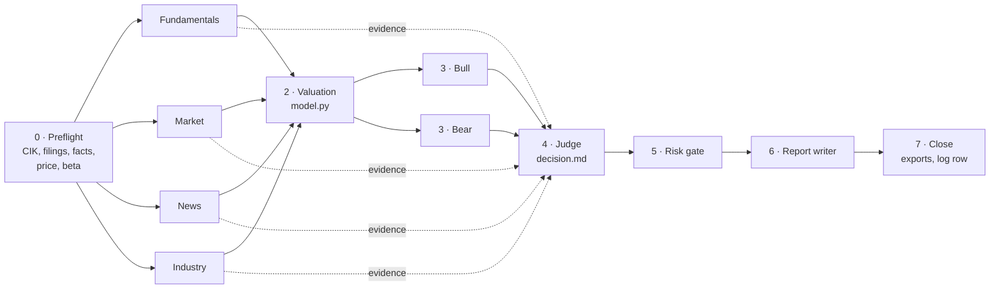

<div align="center">

# Multi-Agent-Equity-Research

### Ten AI agents, eight stages, one typed BUY / HOLD / SELL record, scored against the benchmark twelve months later.

Four analysts gather evidence. A valuation agent builds the base case. A bull and a bear attack it. A judge rules, a risk gate checks the portfolio, and a writer publishes a report, a model workbook and a full audit trail.

*Every call is dated, typed, attributed to the stage that carried it, and scored.*

</div>

---

<div align="center">

**[Quick start](#quick-start) · [First five minutes](#the-first-five-minutes) · [Talk to it](#talk-to-it) · [What's live](#whats-live) · [Under the hood](#under-the-hood) · [Keys and costs](#keys-and-costs)**

</div>

---

## Why this exists

Most AI stock research produces an opinion and forgets it. This repository produces a record. Each run ends in a decision file with typed fields, three built artefacts, and a row in a calls log with a review date a year out, when the call gets scored against alpha rather than raw return.

The design does not assume ten agents beat one. That is the open question the repository is set up to answer. Run it on tickers you already cover by hand, compare the calls, and let the log decide.

The orchestrator is a human running Claude Code. It sequences the stages and builds the deliverables, and does no analysis of its own.

## What a run gives you

| Artefact | What it is |
|---|---|
| Report PDF | The institutional report in the company's brand colours, twelve to eighteen pages on a real ticker |
| Model XLSX | Fourteen sheets: ten-year statements, common-size, ratios, segments, estimates, DCF, scenarios, sensitivity, comps, football field, sources |
| Workpapers DOCX | Every agent's output in stage order, unedited |
| `decision.md` | The typed record: rating, target, expected return, scenario weights, which stage decided it, and the one assumption that would flip it |
| Calls-log row | The call, the price, the target and the review date, waiting to be scored |

No figure is retyped between them. The workbook and the PDF both import the run's `model.py`, and the rating and target come from `decision.md` front-matter and nowhere else.

---

## Quick start

You can see everything the pipeline produces without an API key, a market-data account or Claude Code. The repository ships a complete worked run on an invented company, and the three builders are plain Python.

### Path 1: build the example, no keys

Python 3.11 or newer.

```bash
git clone https://github.com/Vidwaansinghania/Multi-Agent-Equity-Research.git
cd Multi-Agent-Equity-Research
pip install -r requirements.txt
```

```bash
python build/build_workpapers.py example/Acme/runs/2026-01-15
```

```bash
python build/build_workbook.py example/Acme/runs/2026-01-15
```

```bash
python build/build_report.py example/Acme/runs/2026-01-15 --brand "#1F5C8B" --brand-source "investor relations stylesheet"
```

You get a twelve-section Word file, a fourteen-sheet workbook and a six-page PDF in `example/Acme/runs/2026-01-15/exports/`. Acme Materials Corporation does not exist, so nothing in it is a view on a real security.

<details>
<summary>On Windows</summary>

Set `PYTHONIOENCODING=utf-8` before running the builders, or a minus sign in the console output raises a `UnicodeEncodeError` on the default code page. In PowerShell:

```powershell
$env:PYTHONIOENCODING = "utf-8"
```

</details>

### Path 2: run it on a real ticker

This needs Claude Code and, optionally, a market-data connector. See [Keys and costs](#keys-and-costs).

```bash
cp config.example.toml config.toml
mkdir -p .claude/skills && cp -r skills/method-2 .claude/skills/
```

Set `analyst.name` and `analyst.email` in `config.toml`. The name goes on the report cover and the email goes into the SEC EDGAR User-Agent, without which EDGAR refuses every request. Then open the folder in Claude Code and type:

```
run a multi agent equity research report on MSFT
```

`config.toml` and `research/` are both gitignored, so your details and your research stay out of the repository. Full setup is in [docs/02-setup.md](docs/02-setup.md).

---

## The first five minutes

Build the example first (Path 1 above), then go through it in this order.

1. **Open the PDF.** `ACME_Method2_Report_2026-01-15.pdf`. The cover carries the rating, the target and the expected return. The cover reads `[ANALYST NAME]` until you set one; the build tells you so.
2. **Read the decision record.** Open `example/Acme/runs/2026-01-15/decision.md` and look at the front-matter. HOLD at $108.50, +10.7% expected, `marginal: true`, and a `flip_assumption` saying that at 15% bear weight instead of 25% the call becomes BUY. That field is required on every call within five points of a band edge.
3. **See who decided it.** `decided_by: industry`. The judge credited the industry analyst's buyer-power finding, not the valuation agent. Across a dozen real runs, this field shows whether the debate stages earn their cost.
4. **Read the fight.** `bull.md` and `bear.md` each attack the same base case by naming an assumption, giving its value in the memo, and computing what a different value does to the target. The judge's rejection of each argument is written down in `decision.md`.
5. **Open the workbook.** `ACME_Method2_Model_2026-01-15.xlsx`. The DCF, scenarios and sensitivity sheets come straight from `model.py`. Change a literal in `model.py`, rebuild, and both the workbook and the PDF move together.
6. **Skim the workpapers.** `ACME_Method2_Workpapers_2026-01-15.docx` is every agent's file in stage order, word for word. This is what you check when a number in the report looks wrong.
7. **Read what the PDF build printed.** It lists every sentence it stripped from the report and the contrast check behind every colour it used. Both lists are there to be read.

---

## Talk to it

The pipeline starts on one phrase and only that phrase. A full run spawns ten agents and spends a daily market-data quota, so the skill is written to refuse anything that merely sounds like equity research.

**Starts a run:**

> `run a multi agent equity research report on KO`
> `Run a multi-agent equity research report on Coca-Cola`
> `/method-2`

Capitalisation, a hyphen in "multi-agent" and a company name instead of a ticker are all fine. Several tickers run one at a time.

**Does not start a run:**

> `research Costco` · `what do you think of NVDA` · `value this company` · `run the equity process on X`

Claude Code does that work the ordinary way and tells you in one sentence that the trigger phrase exists.

**What comes back.** Nobody is expected to watch a run, so the final message carries everything: the rating, target and expected return, how marginal the call is and which assumption flips it, which stage carried the decision, how it differs from any prior coverage you keep, what the risk gate said about position size and currency drag, and the paths to all three deliverables.

**Other things worth asking** once you are working in the repository:

| Ask | What happens |
|---|---|
| "Rebuild the exports for the ACME run" | Runs the three shared builders against that run folder |
| "Score the calls that are due" | Follows [docs/08-calls-log.md](docs/08-calls-log.md): price and benchmark on both dates, alpha, direction, a short reflection |
| "Check this run against the quality standards" | Reads the run against [docs/10-quality-standards.md](docs/10-quality-standards.md) |
| "Why did the judge override the valuation agent?" | Reads `decision.md` and `valuation.md` and answers from them |

Rules the repository's `CLAUDE.md` holds regardless of what you ask: three ratings only, no figure retyped between files, no agent reads prior coverage of a ticker before the judge rules, and a closed run is never edited.

---

## What's live

| Component | Status | Notes |
|---|---|---|
| Eight-stage pipeline and skill | Working | Full ten-agent runs have closed on real tickers from this process |
| Role prompts and shared preamble | Working | [docs/04-role-prompts.md](docs/04-role-prompts.md), ready to paste |
| Typed decision record | Working | An invalid `rating` value fails the run instead of becoming a fourth tier |
| `build_workpapers.py` | Working | Degrades to a document naming any absent stages |
| `build_workbook.py` | Working | Skips sheets whose input is missing and says so on the README sheet |
| `build_report.py` | Working | Exhibits keyed off section numbers `04`, `05` and `08` |
| `m2facts.py` statement extractor | Working | Ten years out of XBRL company facts in preflight; restated oldest years can differ slightly from the figure first reported |
| Beta in preflight | Working | One, two, three and five-year regressions with standard errors, peers measured the same way |
| Reports shelf | Working | Every closed run's exports copied to `research/reports/` |
| Calls log | Working, manual | Nothing scores automatically; someone runs the review on the due date |
| Colour-blind checks | Partial | Protanopia and deuteranopia validated; tritanopia raises rather than report an unvalidated number |
| Display fonts in the PDF | Partial | Reportlab reads TrueType outlines only; OpenType CFF faces fall back to Helvetica and the build says which font it used |

The questions the process exists to answer, and what answers each:

| Question | Answered by |
|---|---|
| Does adversarial pressure change the call? | Runs where the rating differs from a single-analyst call on the same ticker and date |
| Which stage does the work? | `decided_by` across a dozen runs. If it always reads `valuation`, the debate is decoration and should be cut |
| Is either method any good? | Scored rows in the calls log. The first reviews fall due in 2027 |

---

## Under the hood



The dotted lines are the main departure from the framework the roles come from: the judge reads the four analyst files and the valuation memo alongside both attacks, so the better-argued side does not win by default.

### The eight stages

| Stage | Agents | Model | Parallel | Writes |
|---|---|---|---|---|
| 0 · Preflight | orchestrator | — | — | `run.md`, `companyfacts.json`, seeded `statements.csv` |
| 1 · Evidence | 4 analysts | Sonnet | all four at once | `analyst-*.md`, `statements.csv` |
| 2 · Base case | valuation | Opus | — | `valuation.md`, `model.py` |
| 3 · Debate | bull, bear | Opus, same for both | both at once | `bull.md`, `bear.md` |
| 4 · Judgment | judge | Opus | — | `decision.md` |
| 5 · Risk gate | risk | Opus | — | `risk.md` |
| 6 · Report | writer | Opus | — | `report.md` |
| 7 · Close | orchestrator | — | — | `exports/` ×3, `comparison.md`, calls-log row |

### Design decisions

| Decision | Why |
|---|---|
| The valuation agent may not state a call | Its output is the object the bull and bear attack |
| Bull and bear run on the same model | An asymmetric debate is biased in a way the transcript never shows |
| One agent owns market data | Four analysts each reaching for quotes would spend a day's quota in one stage |
| Everything downstream reads typed files | The rating lives in `decision.md`, the valuation in `model.py`, and nothing keeps a copy |
| The exporters are shared | No run writes its own builder, so a fix reaches every future run |
| Prior coverage stays sealed until stage 7 | Reading an existing call first turns the run into a confirmation of it |

### Three ratings

BUY above +15%, HOLD between −15% and +15%, SELL below −15%, on the probability-weighted twelve-month total return. A call within five points of a band edge is marked marginal and has to name the single assumption that would move it.

### How it differs from TradingAgents

The role decomposition comes from [TradingAgents](https://github.com/TauricResearch/TradingAgents) (Tauric Research, Apache-2.0). Five things are deliberately different:

| TradingAgents | Here |
|---|---|
| Five-tier rating parsed from prose by a regex that defaults to Hold when it misses | Three tiers in a typed field; an invalid value fails the run |
| The judge reads only the debate transcript | The judge reads the evidence and both attacks |
| Bull and bear argue in the abstract | Both attack a stated base case with explicit numbers |
| Social-media sentiment as a co-equal analyst | Absent, or one section of the news file at most |
| Three risk personas argue about temperament | One risk gate computing concentration, correlation and currency drag |

[docs/01-overview.md](docs/01-overview.md) sets out the reasoning for each.

### Repository layout

```
build/          the three builders, the statement extractor and two shared modules
docs/           the process, start to end
skills/         the Claude Code skill that carries the trigger phrase
templates/      empty run.md, decision.md, model.py, statements.csv, calls log
example/Acme/   a complete worked run on an invented company, with built exports
config.toml     yours, gitignored; copy config.example.toml
research/       your runs, gitignored: <Company>/runs/<YYYY-MM-DD>/ and reports/
```

### Documentation

| Read | For |
|---|---|
| [01-overview](docs/01-overview.md) | The design decisions, and the comparison with TradingAgents |
| [02-setup](docs/02-setup.md) | Install, configuration, market data, SEC EDGAR access, fonts |
| [03-pipeline](docs/03-pipeline.md) | The eight stages in full, with what each agent receives |
| [04-role-prompts](docs/04-role-prompts.md) | The seven prompts and the shared preamble |
| [05-output-schema](docs/05-output-schema.md) | The typed contracts for `decision.md` and `model.py`, and the rating bands |
| [06-run-anatomy](docs/06-run-anatomy.md) | Where every file goes and what it is for |
| [07-exports](docs/07-exports.md) | The builders, what they need, how they degrade |
| [08-calls-log](docs/08-calls-log.md) | Scoring calls against alpha, and how a run reads its own history |
| [09-failure-modes](docs/09-failure-modes.md) | Symptoms, causes, fixes |
| [10-quality-standards](docs/10-quality-standards.md) | The checklist every stage is held to |

---

## Keys and costs

The builders and the worked example need nothing. A real run needs Claude Code, and everything else has a free route.

| Need | Key | What it does | Get it |
|---|---|---|---|
| Claude Code | Paid plan or API key | Runs the orchestrator and all ten agents | [claude.com/claude-code](https://claude.com/claude-code) |
| SEC EDGAR | None | Filing index, 10-K, 8-Ks and ten years of XBRL statements | A User-Agent header naming you and an email. No signup, but every request without one gets a 403 |
| Market-data connector | Free key, optional | Price history, multiples, consensus, for the market analyst only | Any market-data MCP server. Alpha Vantage's free key allows 25 calls a day |
| stockanalysis.com | None | Price, market cap, multiples and consensus | Read directly |
| FRED | None | The ten-year Treasury as CSV | `fred.stlouisfed.org/graph/fredgraph.csv?id=DGS10` |

Connector identifiers go in `config.toml` under `market_data.connectors`, in the order they should be used. MCP tools carry an identifier and no display name, so the run is handed the mapping rather than guessing it. If a connector is shared with another task, leave it out of the list. API keys never go in `config.toml`; they belong in your MCP client configuration or the environment.

### Market data is a ceiling, not an allowance

`market_data.daily_call_cap` defaults to 75. The worked example answers its market questions in six calls. Free sources cover most of what the market analyst needs, and the free keys are for what they cannot.

### Where the tokens actually go

Two full runs were audited line by line, and both found the cost somewhere other than where it looks.

| Share of the more recent run | What |
|---|---|
| 55% | Instructions and role briefs, re-read on every turn |
| 23% | Reading files and running scripts |
| Under 0.5% | Every web search, page fetch and market-data call together |

Cost inside an agent is roughly its context multiplied by its turn count, so the lever is turns rather than sources. On the first audited run, two analysts made sixty and ninety tool calls, most of them finding filing URLs rather than reading filings, and evidence gathering alone was over a third of the bill. Three changes came out of that, and all three are in the process:

- **Shared work happens once, in preflight.** The CIK, the filing index and the company facts file are resolved before any agent starts, and `build/m2facts.py` turns that file into the ten-year statement series. The fundamentals agent checks those rows instead of rebuilding them.
- **Agents append as they go.** Each writes a section as soon as it finishes one. When three stages of an audited run hit a rate limit, the two holding their work in memory re-ran from zero for about 3.4M tokens, and the one that had been appending resumed.
- **Beta is measured in preflight.** One regression up front is cheaper than four agents and a judge arguing about a number none of them measured.

None of it trades away coverage. The analysts still work independently, the debate still runs both sides on the same model, and the judge still reads the evidence.

<details>
<summary>Changing the models</summary>

`[models]` in `config.toml` sets the model per stage. The analysts default to Sonnet because stage 1 is mostly retrieval and summary over filings, and everything from valuation onward runs on Opus. If you change the debate model, change it for both sides. Every decision record lists the models that produced it, because a call scored a year later is only interpretable if you know what made it.

</details>

---

## Educational and research use only

Nothing this process produces is investment advice. Every report it builds says so, and so does every decision record.

## Licence

MIT. See [LICENSE](LICENSE). The role decomposition is credited to [TradingAgents](https://github.com/TauricResearch/TradingAgents) (Apache-2.0).
